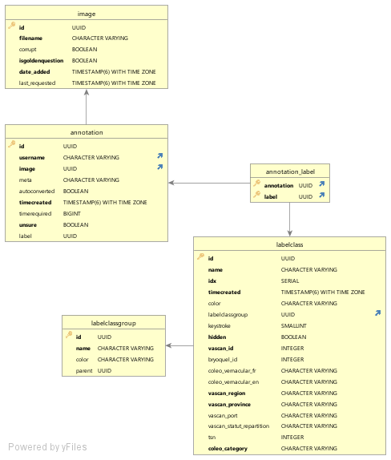

# Relations de la table labelclass (AIDE+MELCC) 

## labelclass
COLUMN_NAME               | TYPE_NAME   | MANDATORY | DEFAULT | REMARKS
------------------------- | ----------- | --------- | --------| ---------------------------------------------------------------------------------------------------------------------------------------------------------------------------------------------------------------------------------------------------------------------------------------------------------------------------------------------------------------------------------------------------------------------------------------------------------------
id                        | uuid        | YES, AUTOGENERATED |  | id is the AIDE internal UUID of the label; the image/tile refer to it; autogenerated, ; part of the original AIDE schema; i.e: "27e2ceb3-449c-11ec-a197-fa163e42617b"
name                      | varchar     | YES |  | name is the VASCAN "Nom scientifique"; string, ; part of the original AIDE schema; i.e. "Abies balsamea"
idx                       | serial      | YES, AUTOGENERATED |  | idx is the index of the record in the table; autogenerated, postgreSQL SERIAL type (integer), unique, , starting from  1; part of the original AIDE schema; i.e. "326"
timecreated               | timestamptz | YES, AUTOGENERATED |  | timeCreated is the timestamp, with the timezone, when the record has been inserted; , postgreSQL TIMESTAMPTZ type; part of the original AIDE schema; i.e. "2021-11-13 11:10:18.759 -0500"
color                     | varchar     | NO | #095797 | color is the background color of the label when it is selected in the AIDE labelizing interface; string representing the hexadecimal value of the color; can be null in which case the AIDE interface will define a value, default is "#095797"; part of the original AIDE schema
labelclassgroup           | uuid        | YES |  | labelclassgroup contains the reference of the label group it belongs, if any; postgreSQL type is UUID, can be null if not part of a group; part of the original AIDE schema; i.e: "27e2ceb2-449c-11ec-a197-fa163e42617b"
keystroke                 | int2        | NO | NULL | keystroke is the keyboard shortkey that can be used to annotate using the keyboard instead of the mouse; integer value, can be null, but must be unique; part of the original AIDE schema; i.e. "7"
hidden                    | bool        | YES | FALSE | hidden is a flag that show or hide the label in the AIDE interface; boolean, default is FALSE; part of the original AIDE schema; i.e. "FALSE"
vascan_id                 | int4        | YES |  | vascan_id is the reference to the VASCAN database ID associated with the VASCAN "Nom scientifique" and the other VASCAN columns of this table; AI model refers to it to train and classify the images/tiles; refer to https://data.canadensys.net/vascan/search; integer, ; source: imported from the Excel document "BdQc_SP_communes_CL_2021-05-18.xlsx", provided by the MELCC; not part of the original AIDE schema, it has been added for the MELCC; i.e: "5482"
bryoquel_id               | int4        | NO | NULL | bryoquel_id is the reference to the Bryoquel id for the bryphytes, based on the definition on "https://github.com/ReseauBiodiversiteQuebec/Coleo_DB/blob/master/API-coleo.md"; integer, can be null, default to NULL; not part of the original AIDE schema, it has been added for the MELCC; source: no value imported, no known data source; no known example
coleo_vernacular_fr       | varchar     | NO | NULL | coleo_vernacular_fr is the VASCAN "Nom vernaculaire français de l espèce"; string, can be null, default to NULL; source: imported from the Excel document "BdQc_SP_communes_CL_2021-05-18.xlsx", provided by the MELCC; refer to "https://github.com/ReseauBiodiversiteQuebec/Coleo_DB/blob/master/API-coleo.md"; not part of the original AIDE schema, it has been added for the MELCC; i.e: "achillée de Sibérie"
coleo_vernacular_en       | varchar     | NO | NULL | coleo_vernacular_en is the VASCAN "Nom vernaculaire anglais de l espèce"; string, can be null, default to NULL; source: imported from the Excel document "BdQc_SP_communes_CL_2021-05-18.xlsx", provided by the MELCC; refer to "https://github.com/ReseauBiodiversiteQuebec/Coleo_DB/blob/master/API-coleo.md"; not part of the original AIDE schema, it has been added for the MELCC; i.e: "Siberian yarrow"
vascan_region             | varchar     | YES | Central | vascan_region is the VASCAN canadian region; string, , default "Central"; source: none, no value imported, defaulted to "Central" as AIDE+MELCC is for the Québec province; refer to https://data.canadensys.net/vascan/search; not part of the original AIDE schema, it has been added for the MELCC; i.e: "Central"
vascan_province           | varchar     | YES | Québec | vascan_province is the VASCAN canadian province; string, , default "Québec"; source: none, no value imported, defaulted to "Québec" as AIDE+MELCC is for the Québec province; refer to https://data.canadensys.net/vascan/search; not part of the original AIDE schema, it has been added for the MELCC; i.e: "Québec"
vascan_port               | varchar     | NO | NULL | vascan_port is the VASCAN "port???? (TODO: clarify)"; string, can be  null, default to NULL; source: imported from the Excel document "BdQc_SP_communes_CL_2021-05-18.xlsx", provided by the MELCC; refer to https://data.canadensys.net/vascan/search; not part of the original AIDE schema, it has been added for the MELCC; i.e: "Plante herbacée"
vascan_statut_repartition | varchar     | NO | NULL | vascan_statut_repartition is the VASCAN statut repartition; string, can be null, default to NULL; source: imported from the Excel document "BdQc_SP_communes_CL_2021-05-18.xlsx", provided by the MELCC; refer to https://data.canadensys.net/vascan/search; not part of the original AIDE schema, it has been added for the MELCC; i.e: "Indigène"
tsn                       | int4        | NO | NULL | tsn is the TSN ID ("Identifiant ITS") as defined in "https://github.com/ReseauBiodiversiteQuebec/Coleo_DB/blob/master/API-coleo.md"; integer, can be null, default to NULL; source: none, no value imported, defaulted to NULL; not part of the original AIDE schema, it has been added for the MELCC; no known example
coleo_category            | varchar     | YES | plantes | coleo_category is the category found in the Colea database, as defined in "https://github.com/ReseauBiodiversiteQuebec/Coleo_DB/blob/master/API-coleo.md"; string, can be null, default to "plantes"; source: none, no value imported, defaulted to "plantes" as AIDE+MELCC is focussed on biodiversity; not part of the original AIDE schema, it has been added for the MELCC; refer to the Coleo_DB URL for the other possible values

## labelclassgroup
COLUMN_NAME               | TYPE_NAME   | MANDATORY | DEFAULT | REMARKS
------------------------- | ----------- | --------- | --------| ---------------------------------------------------------------------------------------------------------------------------------------------------------------------------------------------------------------------------------------------------------------------------------------------------------------------------------------------------------------------------------------------------------------------------------------------------------------
id                        | uuid        | YES, AUTOGENERATED |  | id is the AIDE internal UUID of the group; the labelclass refers to it; autogenerated, ; part of the original AIDE schema; i.e: "27e2ceb3-449c-11ec-a197-fa163e42617b"
name                      | varchar     | YES |  | name is the VASCAN "Rang"; string, ; part of the original AIDE schema; i.e. "Sous espèce"
color                     | varchar     | NO | NULL | color is the background color of the group in the AIDE labelizing interface; string representing the hexadecimal value of the color; can be null in which case the color is the background color; part of the original AIDE schema
parent           | uuid        | YES |  | parent contains the reference of the label group it belongs, if any; postgreSQL type is UUID, can be null if not part of a group; part of the original AIDE schema; i.e: "27e2ceb2-449c-11ec-a197-fa163e42617b"
